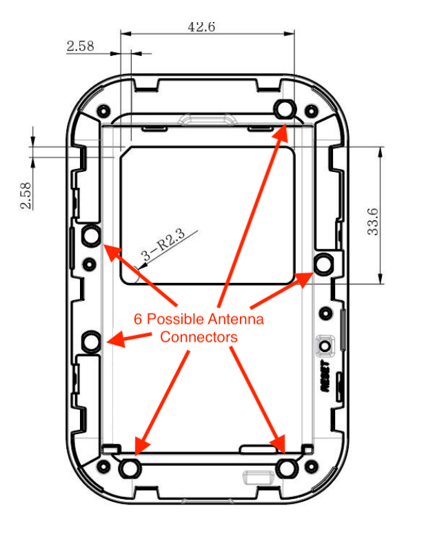
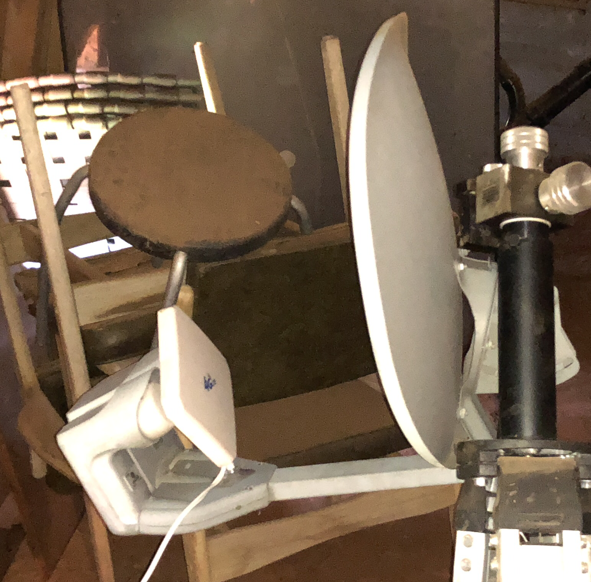

# Documentation of the Franklin R910 for use as a secondary WAN link

### Franklin R910 Device Specifications:

* Battery Life: 12 hrs usage / 27 hrs standby
* Number of Connected Devices: 10 Wi-Fi
* LTE Bands: 25, 26, 41 (aka "Sprint Spark") - hardware also supports 2, 4, 5, 12
* LTE-Advanced Carrier Aggregation
* LTE Performance Category 4 (Max Theoretical Speed: 150Mbps Down / 50Mbps Up)
* Wi-Fi Technology / Frequencies: 802.11 b/g/n - 2.4GHz , 802.11ac - 5GHz
* Dimensions:    3.46" x 2.62" x 0.47" /  3.5 oz

### Antenna Notes:

- Oficially no antenna jacks.
- R910 has small black stickers covering 6 TS9 female connectors. 
- These are around the perimeter of the device, not under the battery or label. 
- the plastic surround of the device contains small antennas that are connected to pads next to these ports.
- removing that plastic surround shows ports that are labeled in pairs: 1708 MAIN, 1708 DIV, B41 MAIN, B41 DIV 
- B41 ports do not appear to improve signal for operation where I am, since band 41 signal appears weak. These appear to be dedicated to band 41 since that uses very different frequencies and modes.
- WARNING: connecting to the B41 connections seems to put the device into an unstable state where it will then not reconnect to any network without a hard reset. 
- Plugging an antenna into 1708 MAIN and 1708 DIV pairs does increase the signal (RSSI and RSRQ) on both bands 25 and 26.
- You can view which band is in use and signal values at [Debug Engineering Hidden Page](http://192.168.128.1/hidden/debug-lte_engineering.html) and the MSL isn't needed to access this page.
- To make connections with the TS9 straight barrel connectors I have, I needed to drill out plastic surrounds with 1/4 inch drill. 
- Placing a [$20 panel antenna](https://www.amazon.com/AMAKE-Connector-Amplifier-Receiver-Broadband/dp/B01HQ2E8IY/ref=pd_sbs_107_2?_encoding=UTF8&pd_rd_i=B01HQ2E8IY&pd_rd_r=BKWRCS2BNCPCZNHSZQ0R&pd_rd_w=fukL7&pd_rd_wg=ouVmZ&psc=1&refRID=BKWRCS2BNCPCZNHSZQ0R) on an old satelite dish and directing this at the tower increase signal strength and speed. 
- Using the satellite dish limits the bands that are used because this is really useful only in the 2 GHz range.

### Tethering Notes:

- Set the USB mode for tethering under [USB mode in the webpst hidden page](http://192.168.128.1/webpst/usb_mode.html) and change to mode "RNDIS + DIAG + ADB [Android]"
- Access to this requires use of the MSL for the device.
- This particular mode makes it look like a phone for tethering versus a dumb modem or usb stick.
- I connected the device to a super cheap GL.iNet mini router and [configure it for tethering](https://www.gl-inet.com/docs/mini/3g4g/#phone-modem-tethering)
- This tiny device runs openwrt and has some useful modules installed.
- Go to advanced settings in the GL.iNet and add the eth0 WAN port to the WAN interface so that usb and eth0 are bridged together
- Connect the upstream router to the GL.iNet WAN port and configure it to do DHCP
- This will get an IP from the r910 directly versus double NAT.
- Then MultiWAN can be configured on the main router.
- using another mode the setting name is "internet" and the APN is "r.ispsn"

### Frequencies:

- Sprint uses LTE bands 25, 26, and 41.
- the modem is configured to use these in that prioritized order.
- the modem also supports 2, 4, 5, and 12.
- wikipedia has a listing of [LTE bands](https://en.wikipedia.org/wiki/LTE_frequency_bands)

| E-UTRA band |	Duplex mode | ƒ(MHz) | Common name | Included in (subset of) band | Uplink (UL) | Downlink (DL) | Duplex spacing | Channel bandwidths |
| -------------- | ------------ | ------------ | ------------ | ------------ | ------------ | ------------ | ------------ | ------------ |         
| 2  |	FDD |	1900 |	PCS blocks A–F  	| 25 |	1850 – 1910 |	1930 – 1990 |	80  |	1.4, 3, 5, 10, 15, 20 	|
| 4  |	FDD |	1700 |	AWS blocks A–F (AWS-1)  | 66 |	1710 – 1755 |	2110 – 2155 |	400 |	1.4, 3, 5, 10, 15, 20 	|
| 5  |	FDD |	850  |	CLR 			| 26 |	824 – 849   |	869 – 894   |	45  |	1.4, 3, 5, 10 		|
| 25 |	FDD |	1900 |	Extended PCS blocks A–G	|    |	1850 – 1915 |	1930 – 1995 |	80  |	1.4, 3, 5, 10, 15, 20	|
| 26 |	FDD |	850  |	Extended CLR		|    |	814 – 849   |	859 – 894   |	45  |	1.4, 3, 5, 10, 15	|
| 41 |	TDD |	2500 |	BRS / EBS		|    | 2496 – 2690  |	N/A         |	    |   5, 10, 15, 20		|

#### Sources:

[Guide to Antenna Connectors](https://buildyourownantenna.blogspot.com/2014/07/guide-to-antenna-cables-and-connectors.html)

[Common RF Connectors](http://specialistantennas.blogspot.com/2013/05/the-10-most-comon-rf-coaxial-connectors.html)

[FCC frequency info on the R910](https://fccid.io/png.php?id=3539957&page=6)

[R910 User Guide](https://www.calyxinstitute.org/sites/all/documents/hardware/Sprint_R910_UserGuide_English.pdf)

[reddit page on the R910](https://www.reddit.com/r/Calyx/comments/7ofbjb/r910_sucks/dupqvn3/?context=1)

[Where to see LTE details on the R910](http://192.168.128.1/hidden/debug-lte_engineering.html)

[Where to change USB mode for tethering](http://192.168.128.1/webpst/usb_mode.html)

[using a old sat dish as a relector](http://fweb.wallawalla.edu/~frohro//Airport/Primestar/Primestar.html)

[CRC9 versus TS9](http://hpanswers.blogspot.com/2014/07/differnce-between-crc9-and-ts9-antenna.html)

[Sprint R910 Page](https://www.sprint.com/en/shop/hotspots/franklin-r910-mobile-hotspot.html)

[RV Mobile Internet Review of R910](https://www.rvmobileinternet.com/review-center/sprint-r910-franklin-wireless/)
